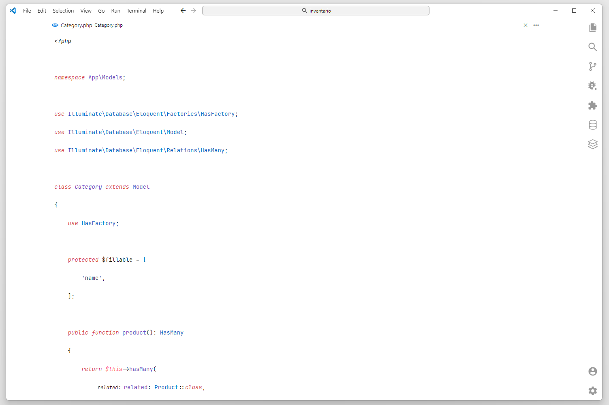
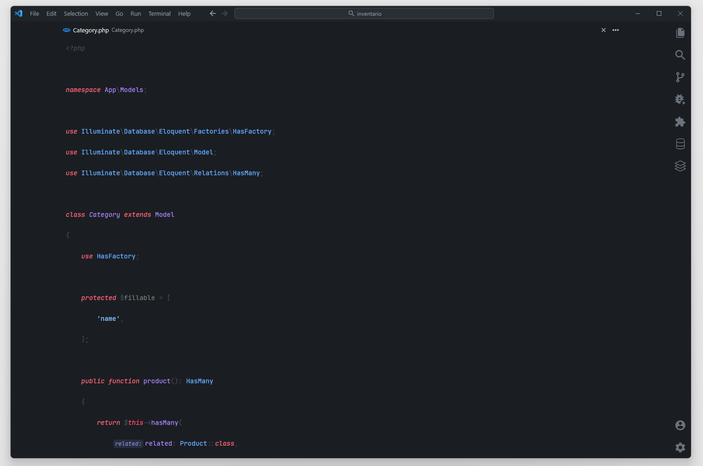

# minimal-vscode
<p align="center">
  
</p>

# Minimal Code

Minimal Code is a set of extensions, settings and keyboard shortcuts that turns Visual Studio Code into a minimal and productive development environment.  
It's focused on minimizing distractions, reducing mouse usage and optimizing the overall workflow.

## Installation

1. Install [Visual Studio Code](https://code.visualstudio.com/Download):
  ```bash
  brew install visual-studio-code
 ```
2. Install [Customize UI](https://marketplace.visualstudio.com/items?itemName=iocave.customize-ui) extension:
   ```bash
   code --install-extension iocave.customize-ui
   ```
3. Install [Github Light Theme](https://marketplace.visualstudio.com/items?itemName=Hyzeta.vscode-theme-github-light) extension:

4. Install [Github Dark Easy](https://marketplace.visualstudio.com/items?itemName=mubaidr.github-dark-easy) extension:
5. Install [Material Product Icons](https://marketplace.visualstudio.com/items?itemName=PKief.material-product-icons) extencion:
6. Install [Run on Save](https://marketplace.visualstudio.com/items?itemName=emeraldwalk.RunOnSave) extencion for laravel paint:

5. Install [JetBrains Mono](https://www.jetbrains.com/lp/mono/) font:
6. Install [Victor Mono](https://rubjo.github.io/victor-mono/VictorMonoAll.zip) Font:

7. Copy the contents of [`src/settings.json`](src/settings.json) to your settings file (search **Preferences: Open Settings (JSON)** using the Command Palette).

## Screenshots



